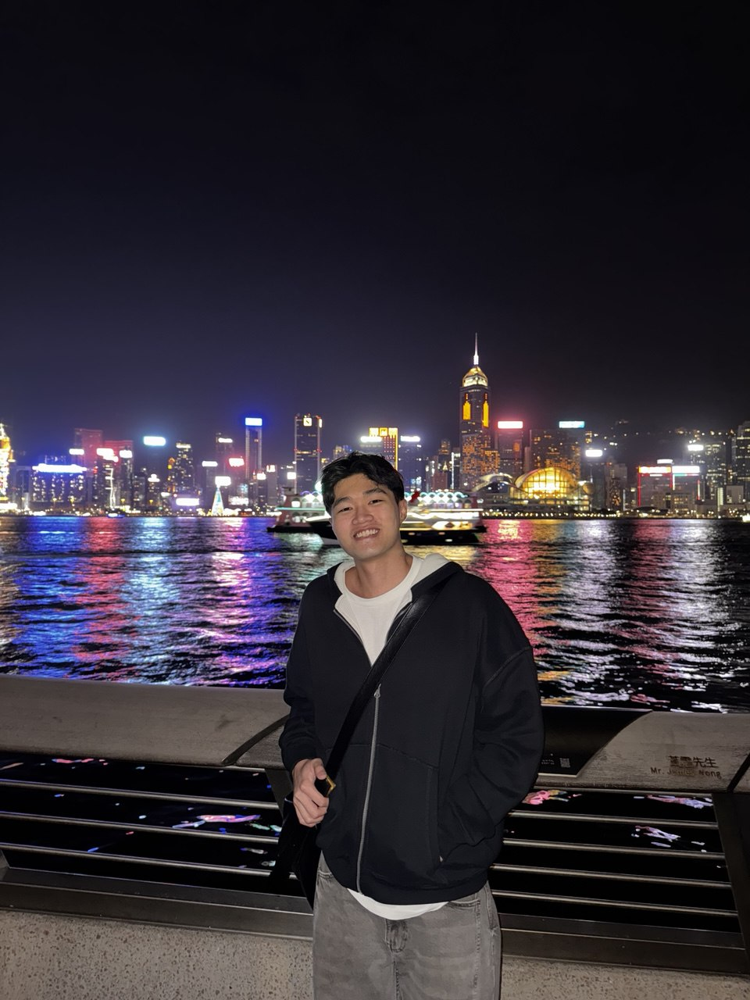

# About Us

We are a team based in the [School of Computing, National University of Singapore](http://www.comp.nus.edu.sg).

You can reach us at the email `seer[at]comp.nus.edu.sg`

## Project team

### Ryan Goh

[[github](https://github.com/ryangoh206)]
[[portfolio](team/johndoe.md)]

* Role: Team Lead
* Responsibilities: Project coordination, Parser component

### Eric Law

[[github](http://github.com/prickloll)]
[[portfolio](team/johndoe.md)]

* Role: Documentation Lead
* Responsibilities: Command

### Yeo Jian Ming

[[github](http://github.com/b2-4ac)] [[portfolio](team/johndoe.md)]

* Role: Code Quality Assurance
* Responsibilities: Storage

### Tan Jian Ron

[[github](https://github.com/jianrontan)]
[[portfolio](team/johndoe.md)]

* Role: Testing Lead
* Responsibilities: model component

### James Doe

[[github](http://github.com/johndoe)]
[[portfolio](team/johndoe.md)]

* Role: Developer
* Responsibilities: UI

